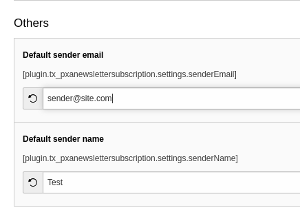

.. include:: ../Includes.txt

.. _configuration:

=============
Configuration
=============

Target group: **Developers, Integrators**

TypoScript settings
^^^^^^^^^^^^^^^^^^^

Sender name and email
"""""""""""""""""""""

It's required to set sender name and email in order to send email notifications

   Constant editor

.. code-block:: typoscript

    # TypoScript constants
    plugin.tx_pxanewslettersubscription.settings.senderEmail =
    plugin.tx_pxanewslettersubscription.settings.senderName =

Subscription target table
"""""""""""""""""""""""""

It's possible to change table where subscriptions are saved. Right now it's saved as frontend users in "fe_users" table.

.. tip::

    TYPO3 9 example

.. code-block:: typoscript

    plugin.tx_pxanewslettersubscription {
        persistence {
            classes {
                # Change mapping table
                Pixelant\PxaNewsletterSubscription\Domain\Model\Subscription {
                    mapping {
                        tableName = another_table_name
                    }
                }
            }
        }
    }

.. tip::

    TYPO3 10 example

In your extension create PHP file with path "Configuration/Extbase/Persistence/Classes.php".

.. code-block:: php

    return [
        Pixelant\PxaNewsletterSubscription\Domain\Model\Subscription::class => [
            'tableName' => 'another_table_name',
            'properties' => [
                // Properties settings
            ],
        ],
    ];

