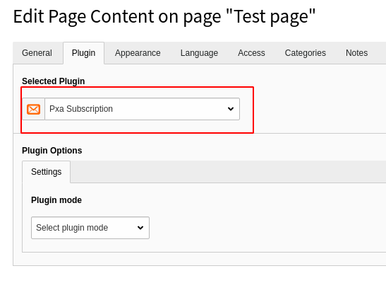

.. include:: ../Includes.txt

.. _for-editors:

===========
For Editors
===========

Target group: **Editors**

Add plugin to page
^^^^^^^^^^^^^^^^^^

Insert new plugin on a page and choose **Newsletter Subscription Form**

   New content element

Configure plugin
^^^^^^^^^^^^^^^^

Plugin supports 3 modes:

- Subscription form
- Confirmation subscription
- Unsubscribe form

Subscription form modes
"""""""""""""""""""""""

The Subscription form presents options that allow you to configure the subscription

 - Subscription email must be confirmed - *If user need to confirm email in order to finish subscription*
 - Resend confirmation email in case user tried to subscribe again, but haven't confirmed subscription yet. - *Available if confirmation enabled*
 - Name is mandatory for subscription - *If enabled, the user will still have to enter email*
 - Storage - *Storage for new subscriptions*
 - Confirmation page (Empty = current page) - *Confirmation page. User will end-up on this page after clicking confirmation link*
 - Unsubscribe page. If set user will get link to it in email - *Unsubscribe page. If set user will get unsubscribe link in email*
 - Accept terms link. If empty user don't need to accept terms - *If set user will have to 'accept terms' before subscribe*
 - Notify subscriber about successful subscription - *If set user will get email about successful subscription*
 - Notify admin (add one or more emails, each in new line) - *Admin emails for notifications*

.. important::

   If the confirmation page is not set, the current page will be used. **In this case make sure that there is only one registration form on the page**

.. important::

   If any email is enabled (user notification, admin notification, etc.) it's required to configure sender in TypoScript constant editor.

Confirmation subscription
"""""""""""""""""""""""""

Confirmation plugin.

.. tip::

    The Subscription confirmation plugin should be added to the confirmation page that was set in Subscription form settings

Unsubscribe from
"""""""""""""""""""""""""

Unsubscribe form has two options:

- Storage - *storage of subscriptions*
- Notify admin (add one or more emails, each in new line) - *admin emails that should be notified about unsubscribe*

.. tip::

    Add this plugin to unsubscribe page if such was set in Subscription form settings